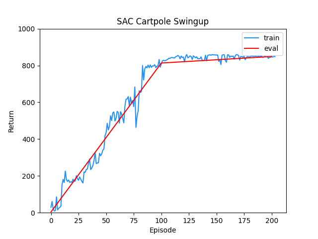
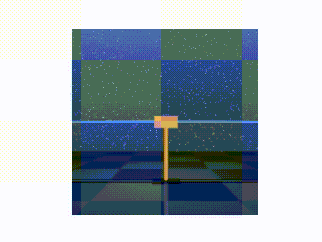
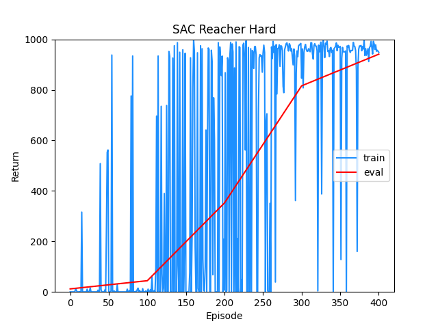
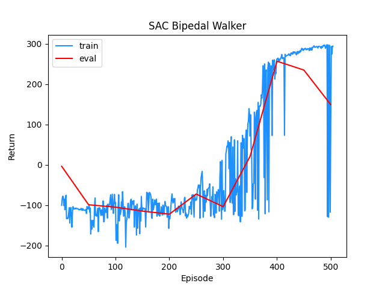
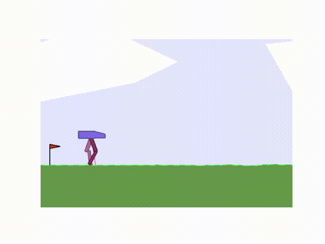

# Soft Actor-Critic (SAC)
This repository contains a clean and minimal implementation of Soft Actor-Critic (SAC) algorithm in Pytorch, for continuous action spaces.

SAC is a state-of-the-art model-free deep RL algorithm for continuous action spaces. It adopts an off-policy actor-critic approach and uses stochastic policies. SAC uses the maximum entropy formulation to achieve exploration.

You can find more details about how SAC works in my accompanying blog post [here](https://adi3e08.github.io/blog/sac/).

## References
* Tuomas Haarnoja, Aurick Zhou, Pieter Abbeel, and Sergey Levine. Soft actor-critic: Off-policy maximum entropy deep reinforcement learning with a stochastic actor. In International conference on machine learning, pages 1861–1870. PMLR, 2018a. [Link](https://arxiv.org/abs/1801.01290)
* Tuomas Haarnoja, Aurick Zhou, Kristian Hartikainen, George Tucker, Sehoon Ha, Jie Tan, Vikash Kumar, Henry Zhu, Abhishek Gupta, Pieter Abbeel, et al. Soft actor-critic algorithms and applications. arXiv preprint arXiv:1812.05905, 2018b. [Link](https://arxiv.org/abs/1812.05905)

## Tested on

* Cartpole Swingup ([Deepmind Control Suite](https://github.com/deepmind/dm_control/tree/master/dm_control/suite)) - Swing up and balance an unactuated pole by applying forces to a cart at its base.

* Reacher Hard ([Deepmind Control Suite](https://github.com/deepmind/dm_control/tree/master/dm_control/suite)) - Control a two-link robotic arm to reach a randomized target location.

* [Bipedal Walker](https://www.gymlibrary.dev/environments/box2d/bipedal_walker/) (OpenAI Gym) - Train a bipedal robot to walk.

 
